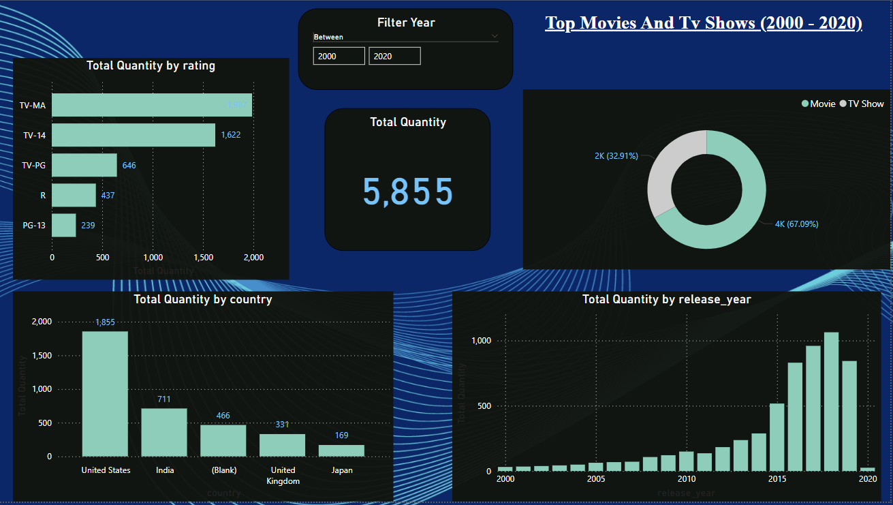

# 🎬 Análisis de las Películas y Shows Más Vistos en Netflix (2000-2020) 🌟

**Explora las películas y series más populares de Netflix a lo largo de dos décadas.**  
Este proyecto visualiza los títulos más **vistos** en la plataforma de **Netflix** entre los años 2000 y 2020, mostrando las preferencias globales en entretenimiento.

## 📌 Descripción

A través de un análisis interactivo, este proyecto presenta las **películas** y **shows de TV** más populares de Netflix durante dos décadas. Los datos permiten observar las **tendencias de visualización** a lo largo del tiempo, con un enfoque en cómo han cambiado las preferencias de los usuarios en este periodo. 

### **¿Qué encontrarás en este análisis?**

✅ **Ranking de películas y shows**: Los más vistos de cada año.  
✅ **Evolución de las preferencias**: Cómo las preferencias de los usuarios han cambiado entre 2000 y 2020.  
✅ **Visualización interactiva**: Navega por los datos y descubre las series y películas que más marcaron a las audiencias.

## 🛠 Tecnologías Utilizadas

- **Power BI** → Para la creación de visualizaciones interactivas.  
- **Excel** → Fuente de datos con información de títulos populares de Netflix.  
- **Power Query** → Para la transformación y limpieza de los datos.

## 🗂 Fuentes de Datos

Los datos provienen de listas y rankings públicos de Netflix sobre las películas y shows más populares entre 2000 y 2020. Estos datos se han procesado y visualizado para ofrecer una experiencia completa al usuario.

## 📸 Vista Previa

## 🛠 Cómo Usarlo

1. Descarga el archivo **.pbix** desde este repositorio.  
2. Ábrelo en **Power BI Desktop**.  
3. Explora las visualizaciones interactivas para descubrir los títulos más populares de Netflix.

## 🌍 Fuentes de Datos

Los datos fueron recolectados de fuentes públicas sobre los rankings de Netflix, incluidas bases de datos de películas y series más vistas.

## ⭐ Contribuye o Apóyame

Si este proyecto te resultó útil o interesante, **⭐ en GitHub** y comparte tus ideas o sugerencias. También puedes contribuir mejorando el modelo o agregando nuevas funcionalidades.

📧 **Contáctame** en [bryanneciosup626@gmail.com] o a través de [LinkedIn](https://www.linkedin.com/in/brayan-rafael-neciosup-bola%C3%B1os-407a59246/).

---

🔗 **Explora las películas y shows que marcaron la historia de Netflix.** 🚀
